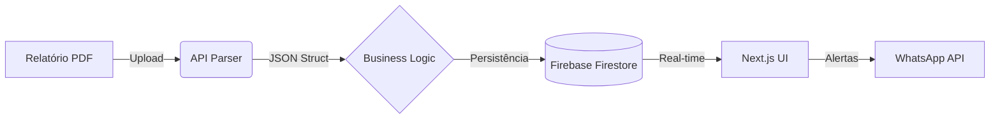

# 📊 Regional Sales Dashboard | Premium Analytics

<p align="center">
  
  
  
</p>

---

## 💎 A Visão
O **Regional Sales Dashboard** não é apenas uma ferramenta de visualização; é um centro de comando estratégico. Projetado para líderes que buscam a excelência, ele combina **inteligência artificial para parsing de dados** com uma interface **ultra-refinada**, permitindo que decisões complexas sejam tomadas com a clareza de um clique.

---

## ✨ Experiência Premium

<table width="100%">
  <tr>
    <td width="50%" style="vertical-align: top;">
      <h3>🚀 Performance Real-Time</h3>
      <p>Acompanhamento de KPIs em tempo real com integração direta ao Firestore, garantindo que os dados nunca estejam desatualizados.</p>
    </td>
    <td width="50%" style="vertical-align: top;">
      <h3>📄 Smart PDF Parsing</h3>
      <p>Extração automatizada de dados de relatórios complexos, eliminando o erro humano e o trabalho manual exaustivo.</p>
    </td>
  </tr>
  <tr>
    <td width="50%" style="vertical-align: top;">
      <h3>📱 Mobile-First Connect</h3>
      <p>Compartilhamento instantâneo via WhatsApp formatado para leitura rápida em dispositivos móveis.</p>
    </td>
    <td width="50%" style="vertical-align: top;">
      <h3>🌓 Dynamic Aesthetics</h3>
      <p>Interface adaptativa que respeita o fluxo de trabalho do usuário, com transições suaves entre temas Dark e Light.</p>
    </td>
  </tr>
</table>

---

## 🛠️ Arquitetura de Dados



---

## ⚡ Quick Start

### 1. Clonagem & Setup
```bash
git clone https://github.com/mroya/regional-dashboard.git
npm install
```

### 2. Configuração (Environment)
Configure suas chaves no `.env.local`:
```env
NEXT_PUBLIC_FIREBASE_API_KEY=...
NEXT_PUBLIC_FIREBASE_PROJECT_ID=...
```

### 3. Decolagem
```bash
npm run dev
```

---

## 🔧 Stack Tecnológica

| Camada | Tecnologias |
| :--- | :--- |
| **Frontend** | React 19, Next.js 16, Tailwind CSS 4 |
| **Backend** | Node.js, Firebase Cloud Functions |
| **Database** | Firestore NoSQL |
| **Data Viz** | Recharts, Lucide Icons |
| **Parsing** | pdf2json Engine |

---

<p align="center">
  Desenvolvido por <strong>Márcio Roya</strong><br>
  <em>Transformando dados em vantagem competitiva.</em>
</p>

<p align="center">
  <a href="https://github.com/mroya"></a>
  <a href="https://www.linkedin.com/in/mroya"></a>
</p>
