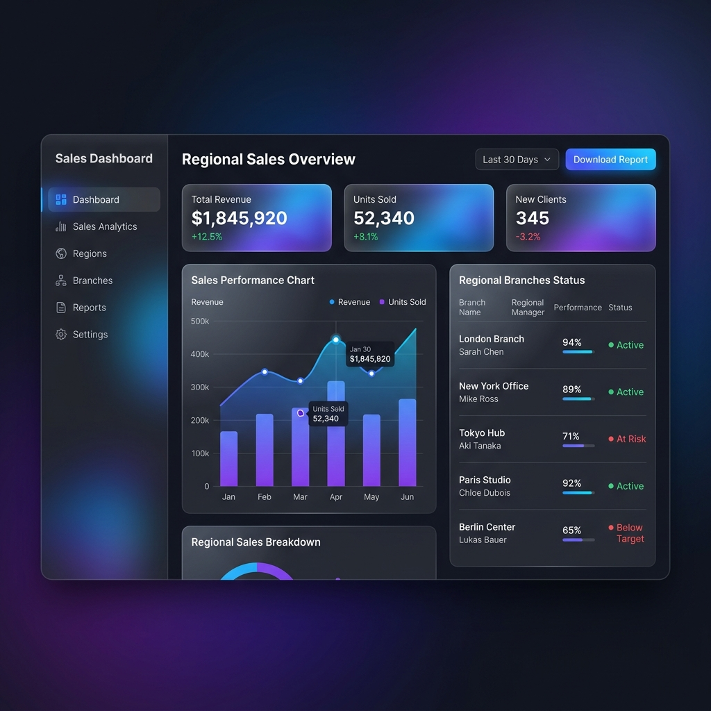

# 📊 Regional Sales Dashboard

> **Uma solução analítica premium para gestão de performance regional em tempo real.**

Este projeto é um dashboard de vendas avançado, desenvolvido para gerentes regionais que precisam de agilidade na interpretação de dados e no acompanhamento de metas. Com uma interface moderna baseada em **Glassmorphism** e processamento inteligente de relatórios PDF, ele transforma dados brutos em insights acionáveis em segundos.

<p align="center">
  
</p>

---

## ✨ Destaques e Diferenciais

- **💎 Interface Ultra-Moderna**: Design premium utilizando Glassmorphism, efeitos de transparência e transições suaves.
- **📄 Inteligência em Dados**: Parser customizado para extração automática de dados complexos de arquivos PDF.
- **📱 Foco em Mobilidade**: Totalmente responsivo e integrado com WhatsApp para comunicação instantânea de resultados.
- **🔒 Segurança Enterprise**: Autenticação e persistência de dados utilizando a infraestrutura robusta do Firebase.

---

## 🚀 Funcionalidades Principais

-   **📈 Visualização de Performance**: Dashboards interativos com Recharts, mostrando tendências e projeções de fechamento.
-   **⚙️ Automação de Relatórios**: Sistema de upload "drag-and-drop" para processamento instantâneo de KPIs.
-   **🟢 Sinalização Inteligente**: Identificação visual automática (Heatmaps e Badges) de filiais que necessitam de atenção.
-   **💬 Quick Share**: Botões de compartilhamento direto para WhatsApp, enviando sumários formatados para equipes.
-   **🌓 Experiência Adaptativa**: Alternância dinâmica entre temas Dark e Light com persistência de preferência.
-   **🌦️ Contexto Local**: Widgets de clima e horário integrados para auxiliar no planejamento logístico regional.

---

## 🛠️ Stack Tecnológica

-   **Core**: [Next.js 16](https://nextjs.org/) (App Router) & React 19.
-   **Estilização**: Tailwind CSS 4 & Custom Design System (Glassmorphism).
-   **Backend & Auth**: [Firebase Firestore](https://firebase.google.com/) & Firebase Auth.
-   **Data Viz**: [Recharts](https://recharts.org/).
-   **Ícones**: [Lucide React](https://lucide.dev/).
-   **PDF Engine**: [pdf2json](https://github.com/modesty/pdf2json).

---

## ⚙️ Instalação e Configuração

### Pré-requisitos
- Node.js 20+ (Recomendado)
- Conta no Firebase

### Passo a Passo

1.  **Clonar o repositório**:
    ```bash
    git clone https://github.com/seu-usuario/regional-dashboard.git
    cd regional-dashboard
    ```

2.  **Instalar dependências**:
    ```bash
    npm install
    ```

3.  **Configurar variáveis de ambiente**:
    Crie um arquivo `.env.local` na raiz e adicione suas credenciais do Firebase:
    ```env
    NEXT_PUBLIC_FIREBASE_API_KEY=sua_key
    NEXT_PUBLIC_FIREBASE_AUTH_DOMAIN=seu_dominio
    NEXT_PUBLIC_FIREBASE_PROJECT_ID=seu_id
    NEXT_PUBLIC_FIREBASE_STORAGE_BUCKET=seu_bucket
    NEXT_PUBLIC_FIREBASE_MESSAGING_SENDER_ID=seu_sender_id
    NEXT_PUBLIC_FIREBASE_APP_ID=seu_app_id
    ```

4.  **Executar em desenvolvimento**:
    ```bash
    npm run dev
    ```

---

## 📱 Estrutura do Projeto

```text
├── app/                # Rotas, Layouts e Componentes da Interface
│   ├── api/            # Endpoints para processamento de PDF
│   └── globals.css     # Design System: Variáveis, Glassmorphism e Tailwind
├── lib/                # Configurações do Firebase e Core Business Logic
├── public/             # Assets estáticos e screenshots
├── src/                # Componentes compartilhados e hooks
└── package.json        # Manifest de dependências e scripts
```

---

## 🤝 Contribuição

Contribuições são fundamentais para a evolução deste projeto. Se você tem sugestões de melhorias ou encontrou algum bug, sinta-se à vontade para abrir uma *Issue* ou enviar um *Pull Request*.

1. Faça um Fork do projeto
2. Crie uma Branch para sua Feature (`git checkout -b feature/AmazingFeature`)
3. Insira suas alterações (`git commit -m 'Add some AmazingFeature'`)
4. Envie para a Branch (`git push origin feature/AmazingFeature`)
5. Abra um Pull Request

---

## 📄 Licença

Distribuído sob a licença MIT. Veja o arquivo `LICENSE` para mais detalhes.

---

<p align="center">
  Desenvolvido com foco em alta performance e excelência visual.
</p>
